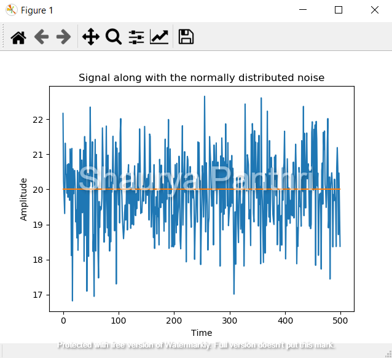

Hi, I am Shaurya Panthri, graduate student at CU ICAR.
This repository has files dealing with projects on Perception.
## Parking Space Hough Lines

Histogram Equivalization

Binary Image

Hough Lines

Parking Space detected

Bounding Box   

## Project 1 Signal Processing and Visualzing Nuscenes Data set

Time and Frequency Domain Analysis

Fast Fourier Transform

NuScenes Radar data and Labelling

Visualizing objects with intensity

## Project 2

RGB intensity
conversion using NTSC by splitting the 3 channel RGB image into single gray scale by converting using
the formula: 0.2989 * r + 0.5870 * g + 0.1140 * b

Down-sampling image

edge detection of the image

Sobel in X direction

edge detection of the image
  

Edge detection of Lenna Gray using resultant of Gx and Gy : Sobel 

Histogram Analysis 

Cumulative Histogram Distribution

Histogram Equivalization    

Result of   Histogram Equivalization   

## Project 3 Lidar

Downsampling with Box Filter

RANSAC algorithm  to the 3D voxel space points to find a ground plane model

Visualize off grounf points

Visualize in Spherical coordinates

License
Copyright (C) 2020 Shaurya Panthri.

This program is free software: you can redistribute it and/or modify it under the terms of the GNU General Public License as published by the Free Software Foundation, either version 3 of the License, or (at your option) any later version.

This program is distributed in the hope that it will be useful, but WITHOUT ANY WARRANTY; without even the implied warranty of MERCHANTABILITY or FITNESS FOR A PARTICULAR PURPOSE. See the GNU General Public License for more details.

You should have received a copy of the GNU General Public License along with this program. If not, see http://www.gnu.org/licenses/
