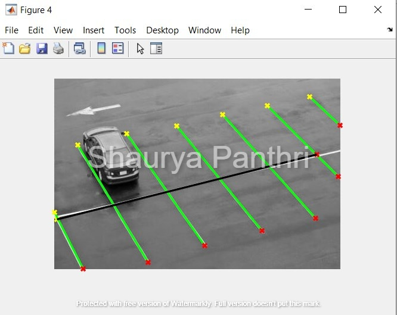

Hi, I am Sharuya Panthri, graduate student at CU ICAR.
This repository has files dealing with projects on Perception.

## Project 1 Signal Processing and Visualzing Nuscenes Data set
 
  
   
    
     
      
       

## Project 2
 
  
   
    
     
      
       
        
         
          
           
            
             
             
             
             
             
             
             
             
             
             
             
             

## Project 3 Lidar
 
  
   
    
     
      
       
