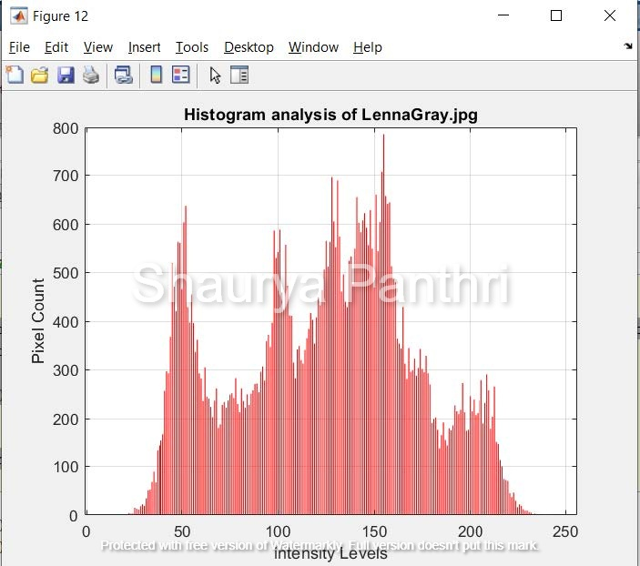

Hi, I am Sharuya Panthri, graduate student at CU ICAR.
This repository has files dealing with projects on Perception.
## Parking Space Hough Lines

             
             
             
             
             
             
             
             
             
             
             
             
             
             
             

## Project 1 Signal Processing and Visualzing Nuscenes Data set
 
  
   
    
     
      
       

## Project 2
 
 
 RGB intensity
conversion using NTSC by splitting the 3 channel RGB image into single gray scale by converting using
the formula: 0.2989 * r + 0.5870 * g + 0.1140 * b
  
  
  
   
   
   Down-sampling image
   

  
  edge detection of the image
  
    
  
  Sobel in X direction
  
     
     
   edge detection of the image
       
  
   Edge detection of Lenna Gray using resultant of Gx and Gy : Sobel 
     
     
   Histogram Analysis 
     
          
    
   Cumulative Histogram Distribution
          
           
  
  Histogram Equivalization    
       
            
            
 Result of   Histogram Equivalization   
         

## Project 3 Lidar
 
  
   
    
     
      
       
